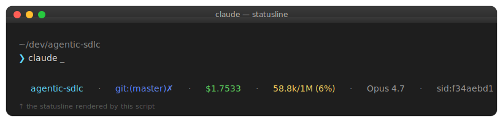

# Claude Code Statusline

A rich, configurable status line for [Claude Code](https://claude.com/claude-code). Shows workspace, git branch, cost-so-far, context usage, model, session, plus optional segments for todos, background tasks, subagents, hooks, rate-limits, MCP servers, and memory entries.



## Features

Six segments enabled by default:

- **workspace** — current project folder name
- **branch** — git branch with dirty marker (`✗`)
- **cost** — total session cost in USD
- **ctx** — context window usage (e.g. `58.8k/1M (6%)`)
- **model** — model display name (e.g. `Opus 4.7`)
- **sid** — short session id

Seven optional segments (disabled by default — flip a flag to enable):

- **todo** — current TodoWrite count
- **bg** — running background bash tasks
- **agents** — active subagents
- **hooks** — number of configured hooks (global + project)
- **rl** — 5-hour / 7-day rate-limit usage
- **mcp** — connected MCP servers
- **mem** — memory entries for the current project

## Install (one-liner)

```bash
curl -fsSL https://raw.githubusercontent.com/aliaksei-hlazkou/agentic-sdlc/master/statusline/install.sh | bash
```

Then restart Claude Code (or run `/statusline` inside a session) for the new status line to appear.

## Dependencies

`bash`, `curl`, `jq`, and `git` must be on `PATH`.

| OS                       | Install jq                                  |
|--------------------------|---------------------------------------------|
| macOS                    | `brew install jq`                           |
| Linux (Debian/Ubuntu)    | `sudo apt install jq`                       |
| Linux (Fedora)           | `sudo dnf install jq`                       |
| Linux (Arch)             | `sudo pacman -S jq`                         |
| Windows — Git Bash       | `winget install jqlang.jq` (or chocolatey)  |
| Windows — WSL            | use the Linux line above inside WSL         |

Native Windows PowerShell is **not** supported — use Git Bash or WSL.

## Manual install

If you'd rather not pipe a script:

```bash
mkdir -p ~/.claude
curl -fsSL https://raw.githubusercontent.com/aliaksei-hlazkou/agentic-sdlc/master/statusline/statusline-command.sh \
  -o ~/.claude/statusline-command.sh
chmod +x ~/.claude/statusline-command.sh
```

Then add this to `~/.claude/settings.json` (merging with whatever is already there):

```json
{
  "statusLine": {
    "type": "command",
    "command": "bash /Users/<you>/.claude/statusline-command.sh"
  }
}
```

## Configuration

The top of `~/.claude/statusline-command.sh` is a clean config block. Edit and save — changes apply on Claude Code's next render.

```bash
# Order of segments on screen (also serves as the master list).
ORDER="workspace branch cost ctx model sid todo bg agents hooks rl mcp mem"

# Toggle each segment: 1 = on, 0 = off
ENABLED_workspace=1; COLOR_workspace=cyan
ENABLED_branch=1;    COLOR_branch=blue
ENABLED_cost=1;      COLOR_cost=green
# … etc
```

Available colors: `black red green yellow blue magenta cyan white dim bold`.

To reorder, just rewrite `ORDER`. To hide a segment, set its `ENABLED_*` to `0`.

## Uninstall

```bash
rm ~/.claude/statusline-command.sh
# then remove the "statusLine" block from ~/.claude/settings.json
```

A backup of your previous `settings.json` is saved as `settings.json.bak.<timestamp>` whenever the installer runs.

## Notes

- `$HOME` is built-in on every Unix-like shell — no per-machine configuration needed.
- The script reads JSON Claude Code pipes on stdin (`model`, `cost`, `context_window`, `rate_limits`, `session_id`, `workspace`, `transcript_path`, …) — see the source for the full list.
- The optional `todo`, `bg`, `agents` segments parse the last 500 lines of the transcript JSONL, so they're cheap even on long sessions.
